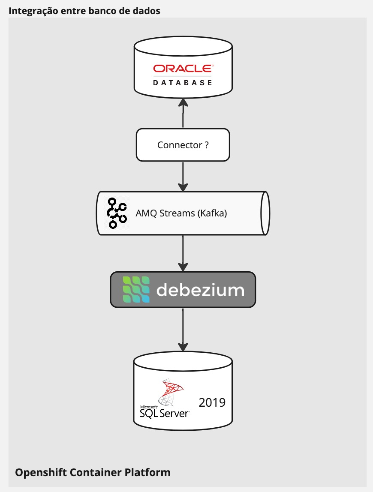
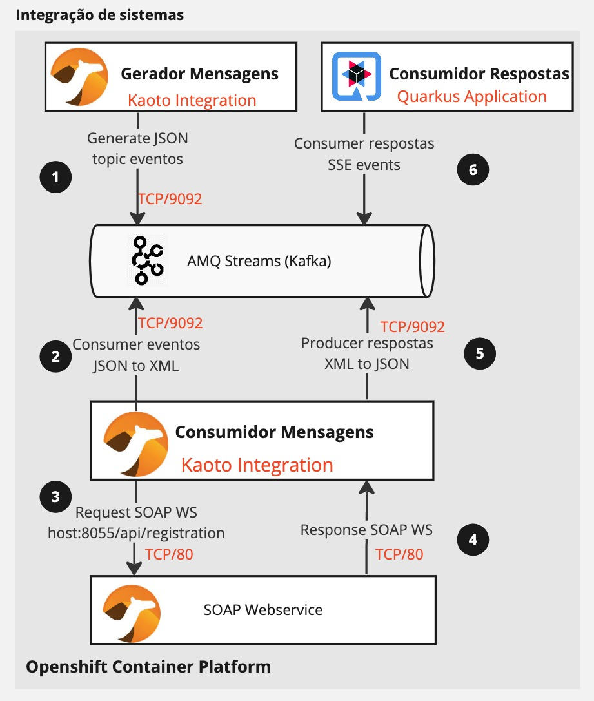
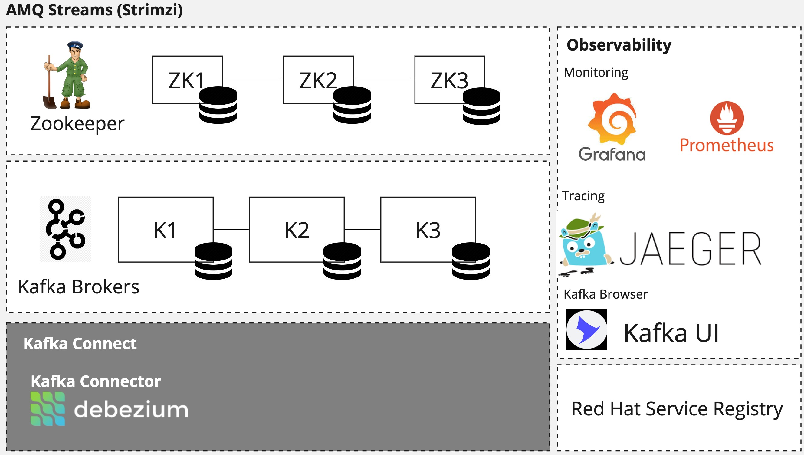
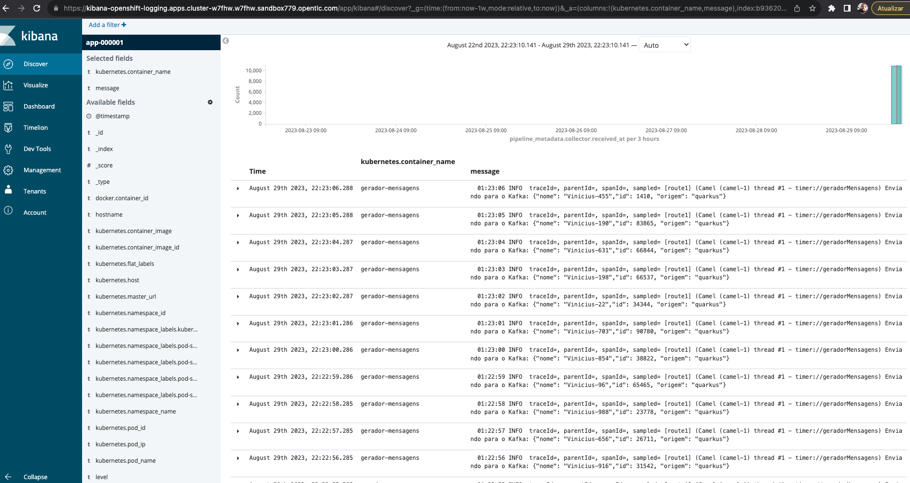
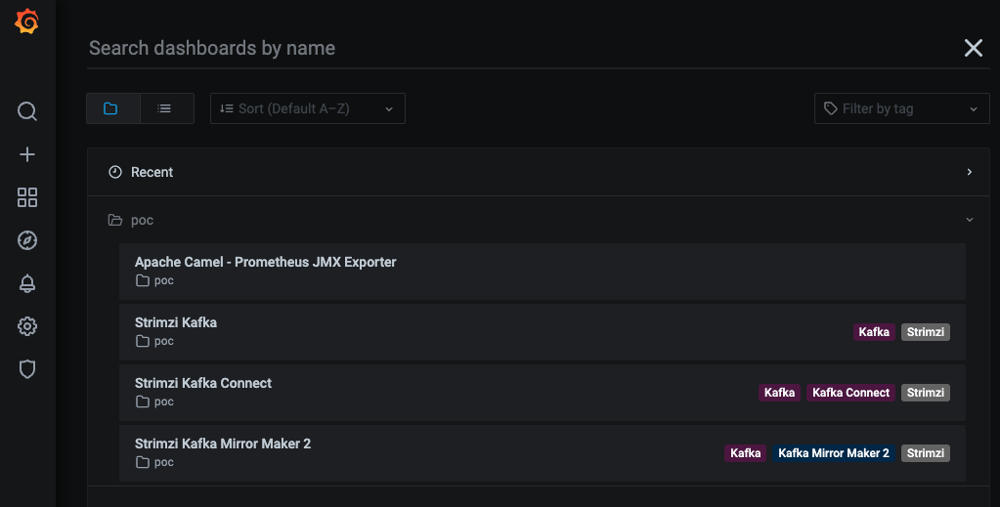
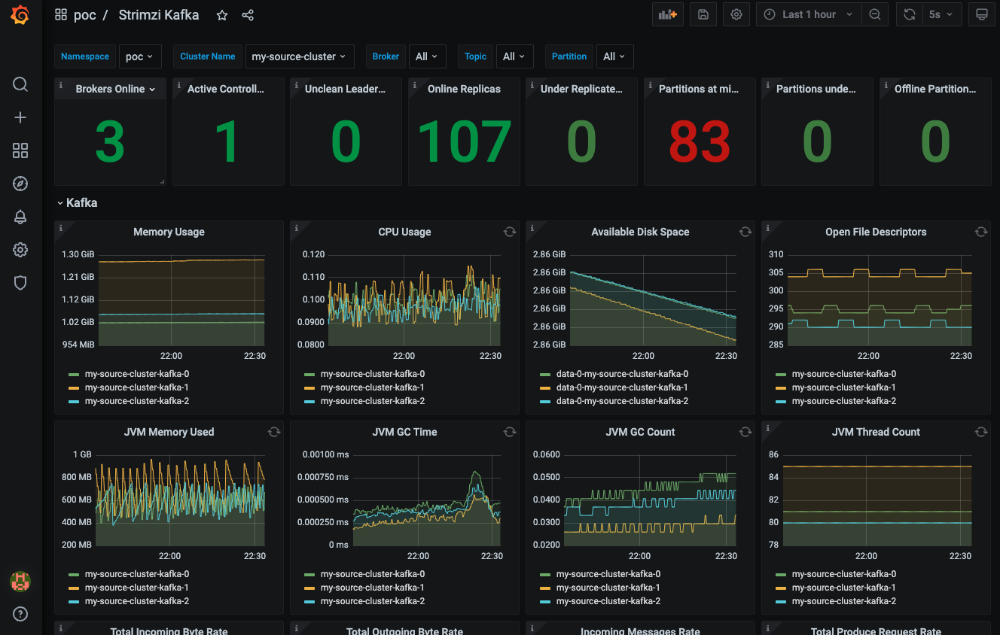
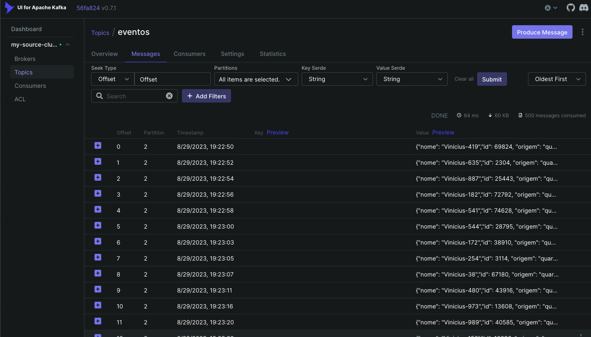
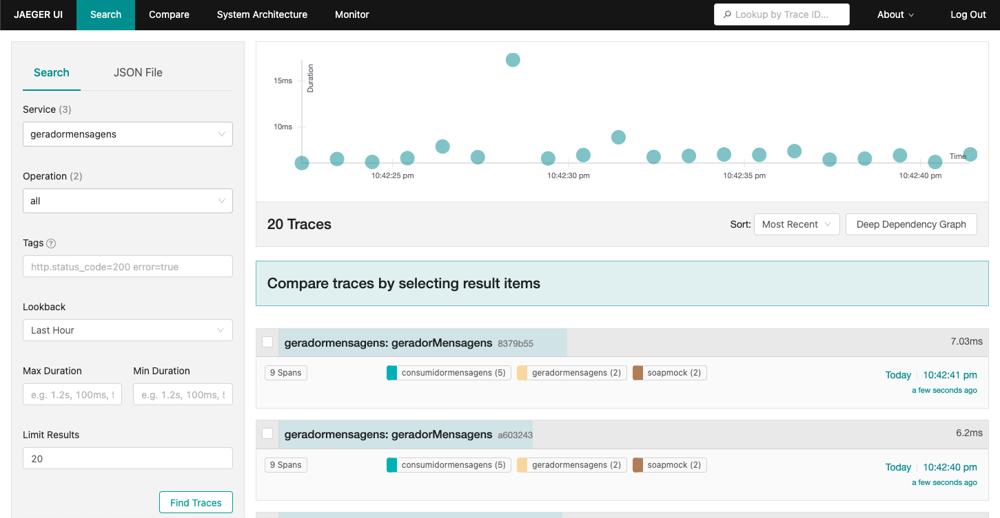
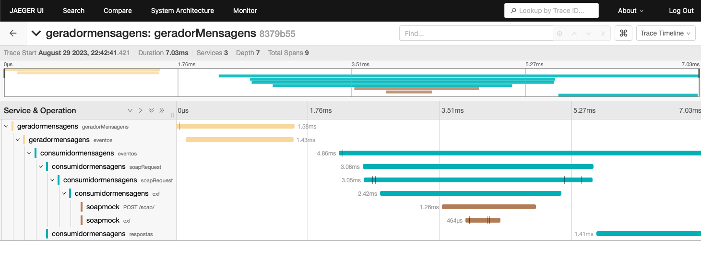
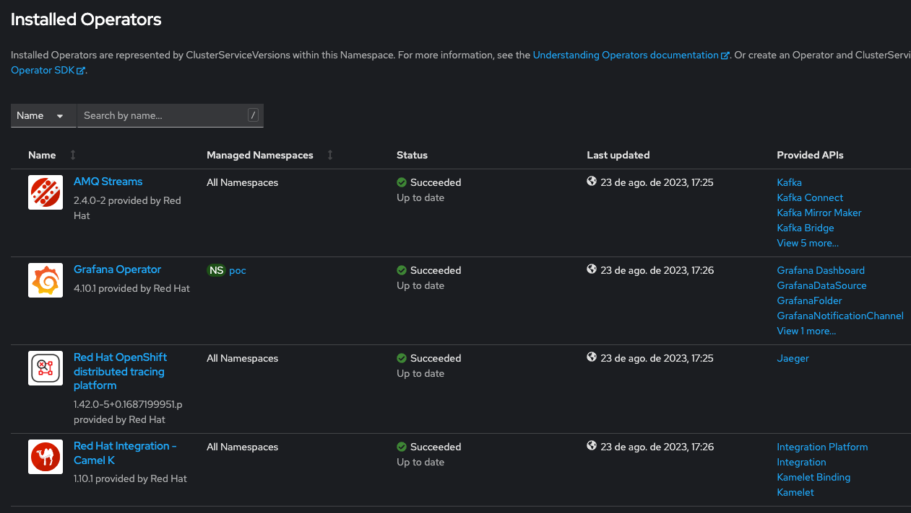

= Debezium database migration

This repository covers two use cases.

. Data migration between SQL Server 2019 and Oracle Database using Chanage Data Capture with Debezium and Strimzi
. Data transformation XML/JSON with Camel and the ability to communicate with REST and SOAP webservices. 

== Data Migration



1. SQL Server is running with `AGENT ENABLED`. Debezium is running as a connector in `Kafka Connect`, connected to the `SQL Server` listen to all events in the `Orders` table.

2. Capture all events from `SQL Server` and send it to `Kafka` in `JSON` format, storing in the `mssql-server-linux.dbo.Orders` topic.

3. Camel application that consume events from the `mssql-server-linux.dbo.Orders` topic, and insert into `Oracle database`.

== System integration



1. Generate JSON messages in each 1 seg and send through the `eventos` topic in `Kafka`.

2. 2 e 5. Consume `JSON` messages from the topic `eventos`, transform it to `XML` and do a SOAP request. Receive a response from the SOAP service, transfor it back to `JSON` and send to the topic `respostas` in `Kafka`.

3. 3 e 4. SOAP Web service built using Camel Quarkus.

4. 6. `Quarkus` application that consume messages from the topic `respostas` and show it in a webpage that is receiving live events using `SSE` (server-sent events).

== Kafka Ecosystem detail



== Logging

If you want to see log aggregation Openshift feature, install this following the https://docs.openshift.com/container-platform/4.13/logging/cluster-logging-deploying.html#cluster-logging-deploying[documentation].



== Monitoring 

https://docs.openshift.com/container-platform/4.13/monitoring/monitoring-overview.html[Official Documentation].

image::images/monitoring-topology.png[monitoring topology]

On this poc we use the `Openshift Monitoring` Stack and a custom `Grafana` to use our own dashboards.

Custom dashboards deployed

. Apache Camel
. Strimzi Kafka
. Strimzi Kafka Connect
. Strimgi Kafka Mirror Maker 2



Sample dashboard of Kafka



Also for browsing Kafka specific components we are using `Kafka UI`.



== Tracing

For tracing we are using the `Openshift Distributed Tracing` Operator with `Jaeger`.





== Install

All the proof of concept it's inside Openshift.

NOTE: I decided to remove Operators logic from the playbooks because it looks to broke whenever there is a new version of a Operator the playbooks starts to fail (It's annoying).

=== Pre requirements

. Red Hat Openshift Platform

==== Openshift Operators 

. AMQ Streams Operator
. AMQ Grafana Operator
. Red Hat Camel K Operator
. Red Hat OpenShift distributed tracing platform



==== Ports in use

[cols="1,1"]
|===
|consumidor-respostas
|8080/TCP

|debezium-connect-cluster-connect-api
|8083/TCP

|grafana-alert
|9094/TCP

|grafana-operator-controller-manager-metrics-service
|8443/TCP

|grafana-service
|3000/TCP

|jaeger-agent
|5775/UDP,5778/TCP,6831/UDP,6832/UDP

|jaeger-collector
|9411/TCP,14250/TCP,14267/TCP,14268/TCP,4317/TCP,4318/TCP

|jaeger-collector-headless
|9411/TCP,14250/TCP,14267/TCP,14268/TCP,4317/TCP,4318/TCP   

|jaeger-query
|443/TCP,16685/TCP

|kafka-ui
|8080/TCP

|mssql-server-linux
|1433/TCP

|my-apache-php-app
|80/TCP

|my-source-cluster-kafka-0
|9094/TCP

|my-source-cluster-kafka-1
|9094/TCP

|my-source-cluster-kafka-2
|9094/TCP

|my-source-cluster-kafka-bootstrap
|9091/TCP,9092/TCP,9093/TCP

|my-source-cluster-kafka-brokers
|9090/TCP,9091/TCP,9092/TCP,9093/TCP

|my-source-cluster-kafka-external-bootstrap
|9094/TCP

|my-source-cluster-zookeeper-client
|2181/TCP

|my-source-cluster-zookeeper-nodes
|2181/TCP,2888/TCP,3888/TCP

|oracle-19c-orapoc
|1521/TCP,5500/TCP

|soapmock
|80/TCP
|===

=== Parameters

[options="header"]
|=======================
| Parameter      | Example Value                                      | Definition
| tkn     | sha256~vFanQbthlPKfsaldJT3bdLXIyEkd7ypO_XPygY1DNtQ | access token for a user with cluster-admin privileges
| server    | https://api.mycluster.opentlc.com:6443             | OpenShift Cluster API URL
|=======================

=== Deploy using Ansible

```
export tkn=sha256~x
export server=https://api.clust2er-6x8wc.6x8wc.sandbox773.opentlc.com:6443

cd ansible
ansible-playbook -e token=${tkn} -e server=${server} playbook.yml
```

== Development 

=== Pre requirements

. JDK 11+
. Quarkus CLI
. Docker / Podman

To run the apps, inside each project run:

    quarkus dev

=== Connecting locally into Openshift databases

    oc port-forward <oracle-pod-name> 1521:1521
    oc port-forward <mssql-server-pod-name> 1433:1433

So use your favorite SQL browser to dig into the data.

