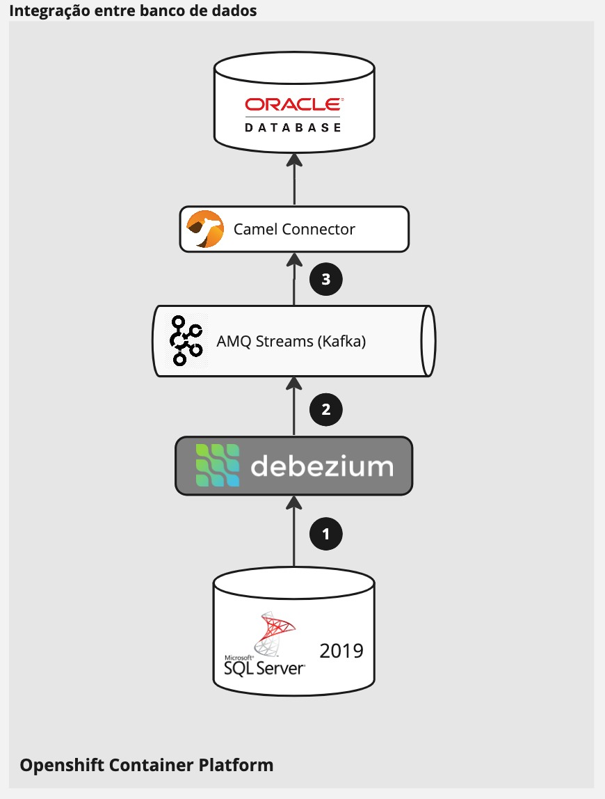

= Debezium database migration

This repository covers two use cases.

. Data migration between SQL Server 2019 and Oracle Database using Chanage Data Capture with Debezium and Strimzi
. Data transformation XML/JSON with Camel and the ability to communicate with REST and SOAP webservices. 

== Data Migration



1. SQL Server is running with `AGENT ENABLED`. Debezium is running as a connector in `Kafka Connect`, connected to the `SQL Server` listen to all events in the `Orders` table.

2. Capture all events from `SQL Server` and send it to `Kafka` in `JSON` format, storing in the `mssql-server-linux.dbo.Orders` topic.

3. Camel application that consume events from the `mssql-server-linux.dbo.Orders` topic, and insert into `Oracle database`.

== System integration

image::images/system-integration.jpg[integration using camel kafka and quarkus]

1. X

2. Y

3. Z

4. D

5. X 

6. OK

7. OK

== Kafka Ecosystem detail

image::images/kafka-ecosystem.jpg[kafka ecosystem detail]

== Install

All the proof of concept it's inside Openshift.

NOTE: I decided to remove Operators logic from the playbooks because it looks to broke whenever there is a new version of a Operator the playbooks starts to fail (It's annoying).

=== Pre requirements

. Red Hat Openshift Platform

==== Openshift Operators 

. AMQ Streams Operator
. AMQ Grafana Operator
. Red Hat Camel K Operator
. Red Hat OpenShift distributed tracing platform

image::images/installed-operators.png[installed operators]

=== Parameters

[options="header"]
|=======================
| Parameter      | Example Value                                      | Definition
| tkn     | sha256~vFanQbthlPKfsaldJT3bdLXIyEkd7ypO_XPygY1DNtQ | access token for a user with cluster-admin privileges
| server    | https://api.mycluster.opentlc.com:6443             | OpenShift Cluster API URL
|=======================

=== Deploy using Ansible

```
export tkn=sha256~x
export server=https://api.clust2er-6x8wc.6x8wc.sandbox773.opentlc.com:6443

cd ansible
ansible-playbook -e token=${tkn} -e server=${server} playbook.yml
```

== Development 

=== Pre requirements

. JDK 11+
. Quarkus CLI
. Docker / Podman

To run the apps, inside each project run:

    quarkus dev

=== Connecting locally into Openshift databases

    oc port-forward <oracle-pod-name> 1521:1521
    oc port-forward <mssql-server-pod-name> 1433:1433

So use your favorite SQL browser to dig into the data.

